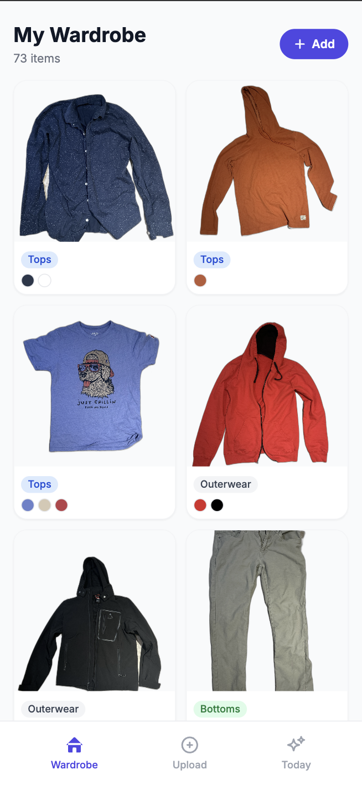
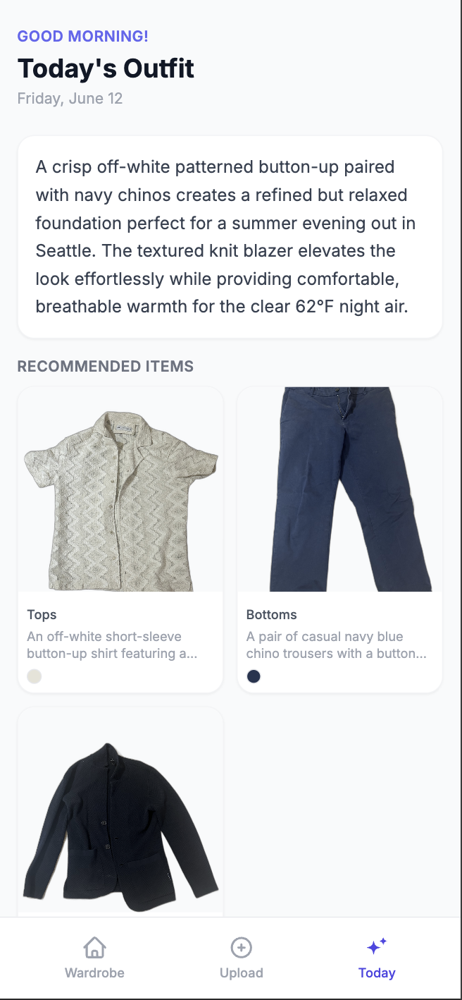

# Hanger Management

A mobile-first wardrobe app. Upload photos of your clothes, get AI-powered daily outfit recommendations with color wheel explanations.

## Screenshots

<p align="center">
  
  
</p>

## Features

- Upload clothing photos — AI (Gemini) auto-detects category, colors, and tags
- Wardrobe grid view with delete support
- Daily outfit recommendation with color harmony visualization
- Free-tier safe: images compressed before upload, storage limits enforced in-app

## Tech Stack

- **Framework**: Next.js 14 (App Router, TypeScript, Tailwind CSS)
- **AI**: Google Gemini (swappable — see [Swapping the AI model](#swapping-the-ai-model))
- **Images**: Vercel Blob
- **Database**: Vercel Postgres
- **Image processing**: sharp (resize + compress before upload)

## Local Setup

### 1. Install dependencies

```bash
npm install
```

### 2. Create Vercel storage

In your [Vercel dashboard](https://vercel.com/dashboard) → Storage:

- Create a **Postgres** store
- Create a **Blob** store

Download the `.env.local` snippet from each store's dashboard page, or copy the values manually.

### 3. Configure environment variables

```bash
cp .env.local.example .env.local
```

Fill in `.env.local`:

```env
GEMINI_API_KEY=your_gemini_api_key   # console.google.com → AI Studio

# From Vercel Postgres dashboard
POSTGRES_URL=
POSTGRES_PRISMA_URL=
POSTGRES_URL_NO_SSL=
POSTGRES_URL_NON_POOLING=
POSTGRES_USER=
POSTGRES_HOST=
POSTGRES_PASSWORD=
POSTGRES_DATABASE=

# From Vercel Blob dashboard
BLOB_READ_WRITE_TOKEN=
```

The database schema is created automatically on first request — no migration step needed.

### 4. Run

```bash
npm run dev
```

Open [http://localhost:3000](http://localhost:3000) on your phone or browser.

## Deploy to Vercel

```bash
npm i -g vercel
vercel
```

Link the project to your Vercel account and connect it to the Postgres and Blob stores you created. Vercel will inject the environment variables automatically.

## Project Structure

```
src/
  types/              # Shared domain types (ClothingItem, OutfitRecommendation, …)
  lib/
    ai/               # AI provider abstraction + Gemini implementation
    db/               # Vercel Postgres queries (schema, clothes, recommendations)
    storage/          # Vercel Blob operations
    api/client.ts     # Typed frontend fetch client
    image.ts          # sharp resize/compress
    config.ts         # Free-tier storage limits
  services/           # Business logic (wardrobe, recommendations, usage)
  app/api/            # Thin HTTP handlers — parse request, call service, return JSON
  app/                # Pages (wardrobe, upload, recommend)
  components/         # UI components (ClothingCard, ColorWheel, Navigation, …)
```

## Swapping the AI model

1. Implement `WardrobeAIProvider` from `src/lib/ai/types.ts`
2. Save it as `src/lib/ai/<provider>.ts`
3. Add a case for it in `src/lib/ai/provider.ts`
4. Set `AI_PROVIDER=<provider>` in your environment

No other files need to change.

## Free Tier Limits

Configured in `src/lib/config.ts`:

| Resource | Limit enforced |
|---|---|
| Vercel Blob | 900 MB (of 1 GB free tier) |
| Vercel Postgres | 230 MB (of 256 MB free tier) |
| Clothing items | 150 max |
| Upload size | 10 MB raw (compressed to ~200 KB before storage) |
